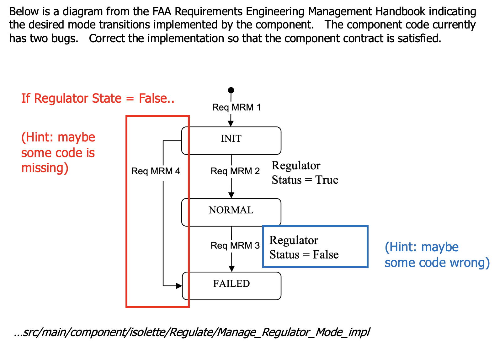

# stress24 - Student Schedule and Guidelines


## Preliminaries

### Install and Confirm Installation with Examples

Make sure that have installed Sireum -- the download and installation instructions can be found [here](stress24-logika-tool-installation.md) 

## Clone the STRESS 2024 repository

Clone the following git repository for the STRESS 2024 material...
```
git clone https://github.com/santoslab/stress24
```

## Opening the Logika examples in the Sireum IVE

**In a terminal window, move to the top level of the git repository that
you cloned above.**, e.g., 
```
cd stress24
```

**MacOS/Linux**

To prepare the following SIREUM IVE projects for use in the SIREUM IVE
(creates IntelliJ metadata for an IntelliJ project)
```
export SIREUM_HOME=~/Applications/Sireum
"${SIREUM_HOME}/bin/sireum" proyek ive stress24-examples-ive
"${SIREUM_HOME}/bin/sireum" proyek ive hamr-examples/isolette/hamr/slang
```

Launch the SIREUM IVE from your file browser or from the command line..
```
open "${SIREUM_HOME}/bin/mac/idea/IVE.app" 
```
..or for linux
```
"${SIREUM_HOME}/bin/linux/idea/bin/IVE.sh"
```

Using the IDE File/Open open, open the `stress24-examples-ive` folder.

**Windows**

To prepare the following SIREUM IVE projects for use in the SIREUM IVE
(creates IntelliJ metadata for an IntelliJ project)
```
set SIREUM_HOME=%USERPROFILE%\Applications\Sireum
"%SIREUM_HOME%\bin\sireum.bat" proyek ive stress24-examples-ive
"%SIREUM_HOME%\bin\sireum.bat" proyek ive hamr-examples\isolette\hamr\slang
```

Launch the SIREUM IVE from your file browser or from the command line..
```
"%SIREUM_HOME%\bin\win\idea\bin\IVE.exe"
```

Using the IDE File/Open open, open the `stress24-examples-ive` folder.


## Morning Session #1 (M1): 1.5 hours

This session will introduce you to the Slang programming language (safety-critical subset of Scala) and the Logika program verifier for Slang.  You will learn basic aspects of the Sireum Integrated Verification Environment (IVE) interface and aspects of the Slang programming language -- building up to some simple exercises using conditional expressions and method calls.

**Overview of Slang/Logika** 

This lecture module is a slide-only overview of Slang and Logika, with
a short summary of the contents of this tutorial.

**Logika Basics**  

This lecture module (a) introduces you the Slang language features (b)
illustrates the basic aspects of interacting with Logika verification.

 * In the `stress24-examples-ive` examples and exercises are found in
   the `Morning-01` folder

In comments in many of the files, simple exercises are suggested for you on
your own.

## Morning Session #2 (M2): 1.5 hour

This module introduces you to Logika verification of while loops

 * In the `stress24-examples-ive` examples and exercises are found in
   the `Morning-02` folder

## Lunch (2 hour break)

## Afternoon Session #1 (A1) 1.5 hours

This module covers advanced Logika techniques related to integrating
SMT-based verification with automated theorem proving techniques.

 * In the `stress24-examples-ive` examples and exercises are found in
   the `Afternoon-01` folder

## Afternoon Session #2 (A2) 1.5 hour

This module illustrates how Logika is integrated with the HAMR
model-driven development environment.

 * Example code is found in the 
   hamr-examples\isolette\hamr\slang

Manage Regulator Mode exercise - see this
[description](slides/Images/HAMR-Manage-Regulator-Mode-exercise.png)



These lectures/activities illustrate the use of Slang and Logika in the context of an industrial strength model-driven development framework called HAMR.   With HAMR, 
* system architectures are defined in AADL or SysMLv2, 
* contracts are added to architecture descriptions to specify desired functional behavior,
* deployable project skeletons are auto-generated from HAMR, along with code-level contracts for application components,
* developers code application logic, and use Logika verification (and automated testing) to demonstrate that the application code conforms to contracts

In this activity, you will learn the basic aspects of the workflow steps above.  *The emphasis is on understanding how Logika verifies that application code conforms to contracts*.

These activities use the KSU SAnToS Isolette example -- a simple
infant incubator with curated artifacts designed to illustrate
end-to-end formal-methods-integrated model-based development.


# Selected Papers Related to Slang, Logika, and HAMR


* Overview of Logika

  Logika: The Sireum Verification Framework.  Robby, John Hatcliff and Jason Belt
Formal Methods for Industrial Critical Systems: 29th International Conference, FMICS 2024, Milan, Italy, September 9–11, 2024, Proceedings
Pages 97 - 116, https://doi.org/10.1007/978-3-031-68150-9_6

  https://people.cs.ksu.edu/~hatcliff/Papers/Robby-etal-FMICS2024-Logika-Overview.pdf

* Teaching with Logika

  Teaching with Logika: Conceiving and Constructing Correct Software.  Hallerstede, S., Hatcliff, J., Robby (2024).  In: Sekerinski, E., Ribeiro, L. (eds) Formal Methods Teaching. FMTea 2024. Lecture Notes in Computer Science, vol 14939. Springer, Cham. https://doi.org/10.1007/978-3-031-71379-8_7

  https://people.cs.ksu.edu/~hatcliff/Papers//Hallerstede-etal-FMTEA2024-Logika-Education.pdf


* Overview of Slang

  Slang: The Sireum Programming Language. Robby, Hatcliff, J. (2021).    In: Margaria, T., Steffen, B. (eds) Leveraging Applications of Formal Methods, Verification and Validation. ISoLA 2021. Lecture Notes in Computer Science(), vol 13036. Springer, Cham. https://doi.org/10.1007/978-3-030-89159-6_17

  https://people.cs.ksu.edu/~hatcliff/Papers/Robby-Hatcliff-ISOLA2021-Slang-Overview.pdf

* Overview of HAMR

  John Hatcliff, Jason Belt, Robby, Todd Carpenter. ``HAMR: An
  AADL Multi-platform Code Generation Toolset''.
  Proceedings of the 10th International Symposium on Leveraging
  Applications of Formal Methods (ISoLA 2021), Rhodes, Greece, October
  17-29, 2021, Lecture Notes in Computer Science 13036,
  Springer 2021, pp. 274-295.
  https://doi.org/10.1007/978-3-030-89159-6_18

  https://people.cs.ksu.edu/~hatcliff/Papers/Hatcliff-etal-ISOLA-2021-HAMR-Overview.pdf

* HAMR development for the seL4 Micro-kernel

  Jason Belt, John Hatcliff, Robby, John Shackleton, Jim Carciofini, Todd Carpenter, Eric Mercer, Isaac Amundson, Junaid Babar, Darren Cofer, David Hardin, Karl Hoech, Konrad Slind, Ihor Kuz, Kent Mcleod. ``Model-Driven Development for the seL4 Microkernel Using the HAMR Framework''. Journal of Systems Architecture
  Volume 134, January 2023.
  https://doi.org/10.1016/j.sysarc.2022.102789

  https://people.cs.ksu.edu/~hatcliff/Papers/Belt-etal-JSA-2022-HAMR-sel4.pdf

* Automated Unit Testing for HAMR

  John Hatcliff, Jason Belt, Robby, Jacob Legg, Danielle Stewart, Todd Carpenter.
  ``Automated Property-Based Testing from AADL Component Contracts'',
  Proceedings of the 2023
  International Conference on Formal Methods for Industrial Critical
  Systems (FMICS 2023),
  LNCS, volume 14290, 2023.

  https://doi.org/10.1007/978-3-031-43681-9_8

  https://people.cs.ksu.edu/~hatcliff/Papers/Hatcliff-al-GUMBOX-FMICS2023.pdf


